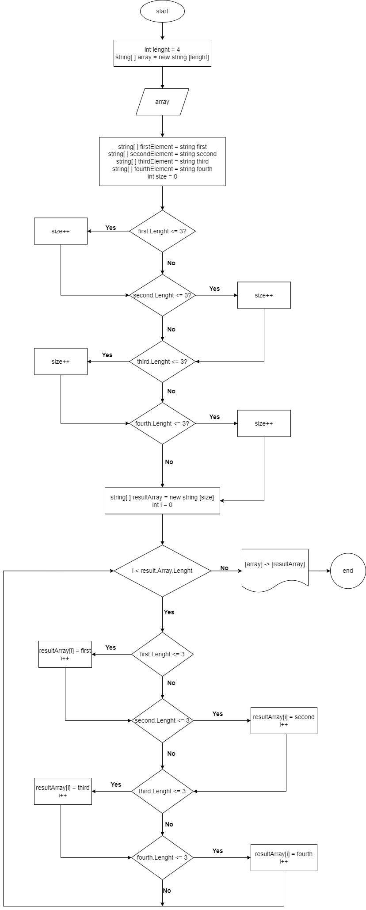

# Итоговая проверочная работа. GeekBrains I четверть. Итоги блока. Выбор специализации. Передовые технологии
## Авторство
+ **Радзевич Карина Вадимовна** (студент факультета "ИТ-инженер. Передовые технологии — Программист. Специализация") - **полноценный проект**
+ Сергей Камянецкий - gitignore файл
## Использованные языки
+ C#(Code)
+ MarkDown(readme.md)
# Здачи проекта
1. Создать репозиторий на GitHub
2. Нарисовать блок-схему алгоритма (можно обойтись блок-схемой основной содержательной части, если вы выдеяете ее в отдельный метод)
3. Снабдить репозиторий оформленным текстовым описанием решения (файл README.md)
4. Написать программу, решающую поставленную задачу
5. Использовать контроль версий в работе над этим проектом (не должно быть так что залито одним коммитом, как минимум этапы 2, 3 и 4 должны быть расположены в разных коммитах)

## **Задача:**
Написать программу, которая из имеющегося массива строк формирует массив из строк, длина которых меньше либо равна 3 символа. Первоначальный массив можно ввести с клавиатуры, либо задать на старте выполнения алгоритма. При решении не рекомендуется пользоваться коллекциями, лучше обойтись исключительно массивами.
## **Примеры:**
``` 
["hello", "2", "world", ":-)"] -> ["2", ":-)"]
``` 
``` 
["1234", "1567", "-2", "computer science"] -> ["-2"]
``` 
``` 
["Russia", "Denmark", "Kazan"] -> []
``` 
# Решенные здачи проекта
 ***1. Репозиторий на GitHub***


[ссылка на репозиторий](https://github.com/KatrinRadzevich/FinalProgect_GB_FirstQuater)
_____
***2. Блок-схема основного метода***
 
[ссылка на блок-схему png формат с открытым к просмотру доступом](https://app.diagrams.net/#G1v74llBnT_xllbPhtzgxEB963b1b3Khlu)
___________________________
***3. Личный сценрий реализации решения задачи c текстовым описанием решения***

+ задаем размерность массива(код написан для массива размерностью в 4 элемента)

+ инициализируем массив размерностью,указанной выше

+ подсказка для пользователя на введение элементов первоначального массива с учетом формата ввода

+ заполняем первоначальный массив методом *FillArray* (зная длину первоначального массива,пробегаемся по всем его элементам, заполняя данными от пользователя)

+ делим первоначальный массив сначала на 2 массива, затем каждую половину первоначального массива еще на 2 массива, используя методы *GetLeftPartOfArray* и *GetRightPartOfArray* (чтобы все элементы первоначального массива стали отдельными массивами, состоящими из 1 элемента)

+ полученные 4 массива  конвертируем в строки для упрощенного уточнения количества символов в каждом элементе

+ задаем результирующий массив. определяем его длину и заполняем его при помощи метода *GetResultArray*. данная часть является основной содержательной частью решения задачи,поэтому поясню ее подробнее
  
       - задаем изначальный размер результирующего массива как 0
       - далее сравниваем каждый элемент первоначального массива(в виде отдельных строк) с числом из условия. если условие выполняется - перезаписываем сумму
       - узнав точный размер результирующего массива используя цикл *While* заполняем результирующий массив, через увеличение счетчика *i*

+ печатаем первоначальный и результирующий массивы с учетом форматирования из примеров 
________________________________
***4. Программа, решающая поставленную задачу***

Решение находится в этом репозитории папка Code [Code/Program.cs](https://github.com/KatrinRadzevich/FinalProgect_GB_FirstQuater/blob/main/Code/Program.cs)
__________________________________
***5. Количество коммитов***

 Условия выполнены
____________________________